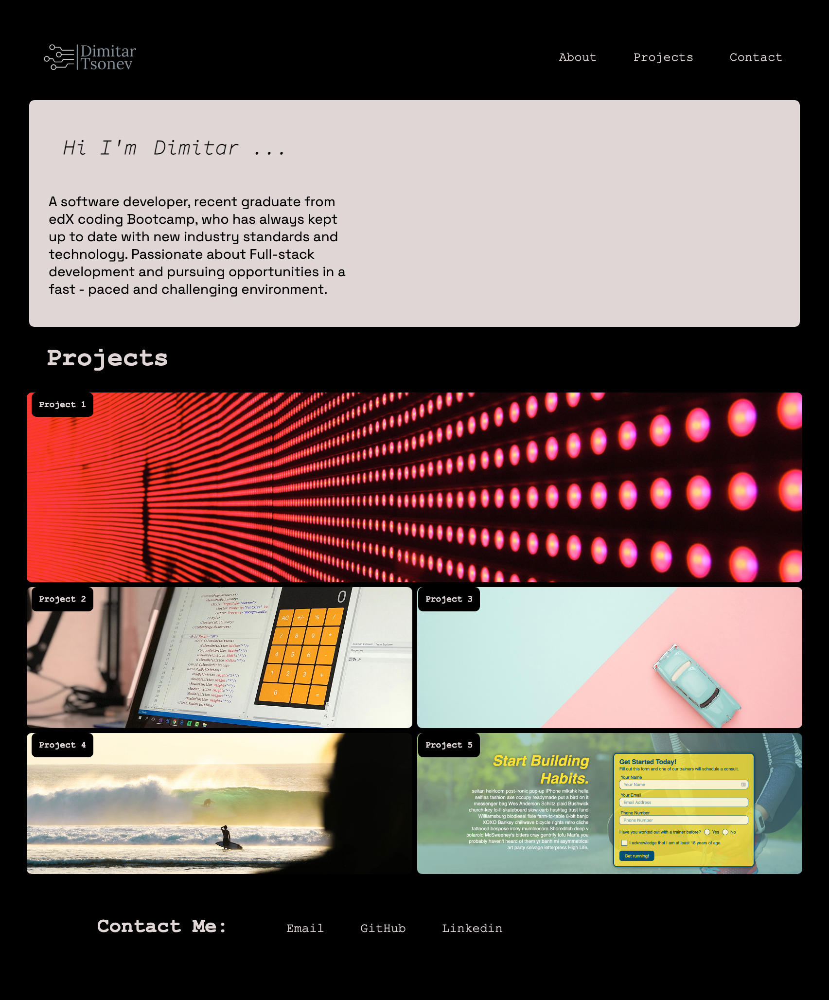

# Portfolio Project Overview

## Overview  

This project aims to fulfill the critical requirements necessary to create a portfolio satisfying the needs of a typical hiring manager. The website will be developed using HTML and CSS to present a user-friendly interface with the following features:

- Upon loading the page, it will display:
  - Your name
  - A recent photo or avatar
  - Links to distinct sections about yourself, your work, and contact information

- The navigation system will function as follows:
  - Clicking on a specific link will smoothly scroll the UI to the corresponding section.

- The 'Work' section will contain:
  - Titled images representing your applications or projects.
  - The first application's image will be larger in size than the others to highlight its prominence.

- Interaction with the application images will allow users to:
  - Click on an image to be redirected to the deployed application.

- The website will be responsive by:
  - Adapting and ensuring a user-friendly layout regardless of the screen size or device used.
  - The layout will adjust dynamically based on viewport changes or various devices, maintaining an optimal user experience.

This project will demonstrate the practical application of HTML and CSS skills while meeting the specific needs and expectations of potential employers.

## The Technologies used

- **HTML5**
- **CSS3**
- **Git and GitHub**

Link to  <a href="https://github.com/D-Tsonev/myPortfolio">GitHub Page</a>

Link to  <a href="https://d-tsonev.github.io/myPortfolio/">Repository</a>

